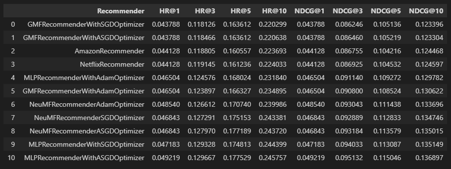

# Neural Network Recommenders

Neural network recommenders with data pre-processing on real buisness hotel data.

Most of the code belongs to **[Piotr Zioło](https://github.com/PiotrZiolo)**, who teaches "Recommendation Systems" in the summer semester 2021/2022. My contribution was to complete the tasks in the indicated places.

---

### Project contains:

:heavy_check_mark: **Cases of data pre-processing that can be found in real business projects**

:heavy_check_mark: **Neural network recommender class written in a way that allows you to easily extend it with different models and optimizers**

:heavy_check_mark: **Configurable properties of recommender class like embedding dimension, hidden dimension, batch_size and more which make it easy to play with these parameters and compare results**

:heavy_check_mark: **Implementation of most popular neural network models: MLP, GMF, NeuMF**

:heavy_check_mark: **Usage of different optimizers: Adam, SGD, ASGD**

:heavy_check_mark: **Tunning recommenders with different optimizers in order to check how usage of different models affect parameters of the same optimizer**

:heavy_check_mark: **Comparison of all nine recommenders with Amazon and Netflix recommenders**

:heavy_check_mark: **Beating Amazon and Netflix recommenders in results after evaluating models with train test split implicit** :bangbang:

---

### Requirements:

1. Install [Anaconda](https://www.anaconda.com/products/individual) with Python 3.8.
2. Install [Visual Studio Code](https://code.visualstudio.com/docs/?dv=win) for comfortable working with jupyter notebooks
3. Open CMD and go to project folder where you can find env.yaml file - it contains information required to correctly create environment
4. Prepare your conda environment (instructions given for Windows 64bit)
```
conda env create --file env.yaml -n rs-nn-env python=3.8.0
```
5. Activate your newly created environment
```
conda activate rs-nn-env
```
6. Open main folder with Visual Studio Code
7. Install two extensions in Visual Studio Code: "Jupyter" and "Python"
8. Open desired .ipynb file and in the top-right side click "Select kernel" and choose your environment "rs-cb-env"
9. If Visual Studio Code will ask you to install ipykernel package, allow it and you are ready to go!
10. Start playing with the code!
---

### Package structure:

```
project_1_data_preparation.html
project_1_data_preparation.ipynb
project_2_recommender_and_evaluation.html
project_2_recommender_and_evaluation.ipynb
results.png
|   
+---data
|   \---hotel_data
|           hotel_data_interactions_df.csv
|           hotel_data_original.csv
|           hotel_data_preprocessed.csv
|           
+---data_preprocessing
|    | 	dataset_specification.py
|    |  data_preprocessing_toolkit.py
|    |  people_identifier.py
|
+---evaluation_and_testing
|   |   evaluation_measures.py
|   |   testing.py        
|           
+---recommenders
    |   amazon_recommender.py
    |   netflix_recommender.py
    |   recommender.py
    
```

Data, data_preprocessing, evaluation_and_testing, recommenders folders mostly contains pre-prepared code by mentioned author.

Main content is in project_1_data_preparation.ipynb and project_2_recommender_and_evaluation.ipynb notebooks.

---

### Results



---

### Summary

To be honest I've never been a huge fan of neural network but I considered this project as an opportunity to learn more about them and open my mind on technology that is crucial in our time.

#### Results of my experiment with different models and optimizers combinations

It's pretty awesome to compare all the results and analyse how performance was increasing with different model and optimizer setup. When I was doing quick tests before final evaluation I thought that GMF with Adam will be the best but it's not. In general it looks like MLP and NeuMF architectures are doing better than GMF and what's more Adam optimizer is not really the best as models with it are worse than with SGD and ASGD. It's very interesting how tunned parameters differs for different setup of model and optimizer and how loss curvers differs. However with additional checks I did it seems that Adam optimizer is more stable than SGD and ASGD but they are still better when it comes to final evaluation. I made what I planned with comparing these different recommenders and I consider it as a good entry point for analysing how to use best possible optimizer for particular model and how neural network architecture is connected to optimizer work. I wonder if it's possible to give real reasons for choosing one optimizer over another by only analysing neural network architecture... In the end MLP with ASGD Optimizer is the winner!

#### What worked well

I am pleased with how I managed to create a base neural network recommender class exactly how I imagined at first place. I wanted to make it easy to extend with other models and optimizers and basically everything but with usage of the given framework at the same time. There is no problem to add new model or optimizer and it requires only few changes. Implementation of MLP, GMF, NeuMF models wasn't very hard because I had knowledge how to do it from lectures. I spent a lot of time on reading about optimizers, it's very interesting what algorithm stants behind them and how they differs. My little experiment shows how results given by different combinations of models and optimizers differs. I think the final results are also fine so everything workout pretty well.  

#### ... and what did not

I think that the tunning of optimizers parameters might be much better because I struggled how to define param spaces for most of them and in the end I tunned number of negative interactions, learning rates and weight decays only but I prepared everything for using all optional parameters of optimizers and tunning them. I spent time on searching for best embedding dimension, hidden dimension, batch sizes and epoch number but the results were not what I expected, for me it was very hard to get reasonable values ​​of these parameters and better results. There was no big improvements so I stayed with values that are defaults in recommender class and didn't include them in final version of notebook as it's pretty big already and I wanted to focus on models and optimizers comparison.

I am also sad that I didn't make hybrid version of recommender because I had an idea to make it configurable also and easily run base recommender as neural network only or as hybrid.
Unfortunately, other subjects at the university take life energy and time which I would need to do this...

#### Model improvement

It would definitely be worth checking how the combinations of models and optimizers I have tested would work in the hybrid recommender. I'm very curious about overall impact of using numerical item and user features... I wonder if hybrid recommender is always better or it depends mostly on the dataset... I wonder how it would work on this dataset and I hope I will find some time to extend this project with hybrid recommender during the holidays.

I also have a feeling that the embedding dimension, hidden dimension and batch sizes might be slightly better than these used by me as default so I would consider finding the best values of these parameters as improvement too because I feel that my empirical tunning might be done better.

#### General feeling

Both projects were great and there was no subject throughout the whole studies that would enter any branch of computer science in such detail. For one person it will be an advantage, for the other a disadvantage. I personally wasn't interested in these topics before the recommendation systems class and at the beginning I was overwhelmed by the amount of information provided in class but now I can say that it was great experience and I'm glad that I had the opportunity to attend these classes.

Thanks for the knowledge!
